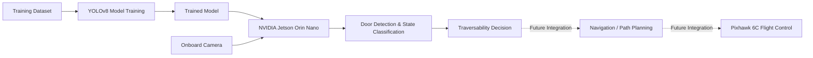

# Autonomous Edge-AI Quadcopter

**Onboard visual perception for autonomous navigation using NVIDIA Jetson Orin Nano, YOLOv8, OpenCV, and a Pixhawk-based quadcopter platform.**

This project explores how a quadcopter can use onboard edge AI to identify physical door states and determine whether an opening is potentially traversable during autonomous navigation.

The system combines a custom power and hardware architecture with a computer-vision pipeline trained off-device and deployed to an NVIDIA Jetson Orin Nano for real-time camera inference. The current implementation detects and classifies doors as open, closed, or ajar, providing a perception layer that can later be integrated with flight-control and path-planning logic.

## System Architecture

The platform separates flight control from onboard AI perception. A Pixhawk 6C manages the quadcopter's flight-control functions, while an NVIDIA Jetson Orin Nano serves as the companion computer for real-time visual perception.

The current perception pipeline works as follows:

1. **Model Training** — Door-state images are prepared and used to train a custom YOLOv8 model off-device.
2. **Edge Deployment** — The trained model is transferred to the Jetson Orin Nano.
3. **Live Perception** — A camera feed is processed with OpenCV and passed to the model for real-time inference.
4. **Door-State Classification** — The system identifies doors and classifies their state as open, closed, or ajar.
5. **Navigation Integration — Planned** — Perception results will ultimately be provided to navigation and flight-control logic so the aircraft can determine whether an opening is traversable and respond autonomously.

The hardware is supported by a custom electrically isolated power-distribution architecture designed to safely power the flight controller, Jetson companion computer, and supporting electronics from the aircraft's LiPo power system.

## Current Project Status

| Capability | Status |
|---|---|
| Custom door-state model training | ✅ Implemented |
| NVIDIA Jetson Orin Nano deployment | ✅ Implemented |
| Live camera inference with OpenCV | ✅ Implemented |
| Open / closed / ajar door classification | ✅ Implemented |
| Quadcopter hardware and power integration | 🔧 In Progress |
| Perception-to-navigation interface | 📋 Planned |
| Autonomous path planning | 📋 Planned |
| Closed-loop autonomous flight through traversable openings | 📋 Planned |

## Repository Structure

* `/architecture`: System flowcharts and power routing diagrams.
* `/hardware`: Mezzanine deck specifications and component lists.
* `/macbook_training`: Local AI training scripts and validation code.
* `/jetson_edge`: Inference scripts and real-time camera handlers.
